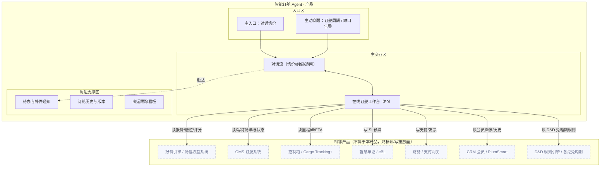

# X 电商订舱 · Agent 产品方案：智能订舱 Agent

> **版本：** v1.0 | **更新日期：** 2026-08-25
>
> **对应业务阶段：** 设计方案（产品方案）· 阶段1 Agent产品方案设计 · 步骤1.1~1.6
>
> **方法论依据：** 产品方案 阶段1方法（产品定位 → 形态架构 → 故事线 → 功能清单 → Agent行为 → 规则消费门禁）
>
> **输入依据：** 理需求《X电商订舱-AI机会场景地图》《X电商订舱-AI场景优先级矩阵》、场景定义《X电商订舱-AI画布-01智能订舱Agent》《X电商订舱-CKD映射》、挖知识《智能订舱Agent-任务流程拆解》《智能订舱Agent-To-be流程》《智能订舱Agent-Agentic工作流》《智能订舱Agent-CKD矩阵分析》、梳理本体《智能订舱Agent-本体设计》

## 1 总览

**这份方案做了什么：** 在已有 AI 场景画布、To-be 旅程与 To-be 流程的基础上，用已完成的任务流程拆解（21 个 L5 深度任务）、五类规则挖掘与本体设计整体回填精化，把「智能订舱 Agent」翻译成一份原型作者可照单施工的产品方案：产品定位、形态架构图、4 条演示故事线、8 项功能与 UI 组件、Agent 行为设计、五类规则消费门禁。

**重点看什么：** 核心仍是「在线订舱工作台」——它是智能订舱 Agent 多能力编排的交付载体（Artifact），全场景唯一 P0（对应任务流程拆解 S3「在线订舱 · 一键订舱与确认」，L5 最密集处）。本版的关键升级在两点：① 故事线 mock 数据从画布口径，对齐到 挖知识已深挖的决策因子矩阵（报价解读因子、舱位综合排序因子、订舱校验规则引擎 200+ 条、单证规则库 300+ 条、ETA 预测多源因子）；② 「五类规则消费门禁」用任务处理规则挖掘清单 + 本体 action_boundaries 的真实承接——把「报价/评分必须来自确定性服务」「订舱为对外承诺必须人工放行」「SI 缺件禁止推送」等护栏，逐一落到 HITL 拦截与出处引用。

**为什么关注：** 商机北极星「电商订舱渗透率 25%[推断]→40%」与「在线订舱确认时效 ≤2h（KPI 3）」「AI 服务分流率 30%+」全由该 Agent 的在线订舱主链路决定。本产品的价值主张是把 AI 客服从「问答」升级为「可执行订舱」，而规则/护栏承接是否「挖到位」，直接决定报价解读、舱位推荐、订舱放行、单证预填是否可解释、可复核、可验收。

**当前洞察：** 挖知识与本体揭示的规则结构高度统一——决策模型类经验集中在「报价解读 / 舱位排序 / 订舱校验 / 单证校验 / ETA 预测」五个环节，且集中在订舱执行与单证预填两段；其中「对外放行订舱」「异常升级人工终审」「SI 缺件禁止推送」「HS 无法映射禁止猜」是硬约束（不可突破），「成本优先」「货期权衡」是软优先级（可冲突仲裁）。这意味着 HITL 设计只需覆盖两类硬闸门 + 少量软优先级冲突点，不必事无巨细地拦截。

**需要 FDE 做什么：** ① 核对本版故事线 mock 数据与 挖知识决策阈值的一致性（订舱校验规则引擎 200+ 条的分类口径、ETA 预测 68% 概率的触发条件）；② 确认「舱位保证 Space Protection 兑现率 95%+」「单证一次提交通过率」的度量口径；③ 视觉基底 P0/P1/P2/P3 锚定与相邻系统（报价引擎 / 舱位收益系统 / OMS / 控制塔 / 智慧单证 / 财务）边界，属阶段2 原型的前置项。

## 2 产品定位

### 2.1 迭代范围

**功能迭代优化（挖知识 + 本体精化）**：在 v1.0 概念级方案基础上，用已完成的 挖知识「深度任务序列（21 个 L5）+ 任务处理规则挖掘清单（五类规则）」与本体「三层本体（对象关系 / 行动边界 / 状态迁移）」回填精化。首版 PoC 范围不变：电商订舱主链路「询价 → 舱位推荐 → 一键订舱 → 单证预填 → 出运跟踪」，聚焦在线订舱一步（P0），验证「AI 问答 → 可执行订舱」能否在订舱确认时效、AI 分流率、单证一次提交通过率之间取得平衡。

### 2.2 产品形态

**B2B 自助服务平台型**：客户 = X 电商订舱平台，用户 = SME 货主直客（王静）/ 货主订舱操作员（陈浩）为主、人工客服 CSR（林晓）为辅；交付物为平台内嵌的对话式订舱 Agent，数据不外流。

### 2.3 四件套

| 子项 | 内容 |
|---|---|
| 产品定位一句话 | 为 SME 货主直客，在「电商订舱」场景下，通过可执行订舱 Agent，把在线订舱确认时效（≤2h）、AI 服务分流率（30%+）、单证一次提交通过率、舱位保证兑现率（95%+）一起往上拉。 |
| 非目标 | ① 不做动态定价与锁价风控（AI 画布-02）；② 不做控制塔预测性预警独立产品（画布-03，本 Agent 只消费其 ETA/预警）；③ 不做智慧单证与 eBL 渗透独立产品（画布-04，本 Agent 只做 SI 预填承接）；④ 不做会员智能运营与复购预测独立产品（画布-05）；⑤ 不直接用 LLM 计算/伪造报价或评分（必须走确定性服务）；⑥ 原型阶段不接真实报价引擎/舱位收益/OMS/控制塔/财务，用 Mock 服务。 |
| 主要使用者 | SME 货主直客（王静）——从自然语言询价起步，一站式完成「比价 → 选舱 → 订舱 → 补件 → 跟踪」；货主订舱操作员（陈浩）——批量订舱与 SI 预填；客服 CSR（林晓）——只承接需人工的复杂异常，标准订舱由 Agent 分流。 |
| Agent 人格 | 身份定位：一名懂航运报价与订舱规则的订舱助手；语气基调：专业、克制、数字驱动（用运价/航程/时效/舱位状态说话）；能力边界：我能做——报价逐项解读、舱位综合排序与推荐、订舱表单自动预填与规则校验、单证抽取预填、出运里程碑/延误预警；我不能做——用 LLM 算价格/评分（只能引用确定性服务结果）、替你拍板最终选择某方案（对外必停）、在舱位未确认时承诺保证、跳过校验/缺件强制放行、HS 无法映射时擅自猜编码。 |

## 3 产品形态架构图

> 三大区齐全；相邻产品 7 个，均只标接触面（读/写），不画协议与字段。核心交付载体为「在线订舱工作台」（M2），为全场景唯一 P0。护栏：报价/评分/校验/ETA 一律来自确定性外部服务，LLM 不直接产出。

## 4 原型演示故事线

> 共 4 条，1:1 对应阶段2 `moments/*.html`。mock 数据均取自 挖知识「任务处理规则挖掘清单」与本体 action_boundaries 的真实决策因子/阈值（脱敏）。

### 故事线 1 · 对话询价与报价解读（新客首单）

| 字段 | 内容 |
|---|---|
| 业务价值高光 | AI 把「上海→洛杉矶 40HQ 全包价多少」一句口语，变成逐项可解读的报价卡，省去多平台比价 |
| 对应阶段 | S1 询价报价（本域·报价与舱位推荐） |
| 演示剧本 | 用户：「上海到洛杉矶 40HQ，10月8日截关的船有吗？全包价多少？」→ Agent 思考（识别询价意图：航线/箱型/期望 ETD，匹配市场基准）→ 调工具（读报价引擎 E-Spot 即期报价 + 舱位收益系统舱位状态 + SCFI 市场基准）→ 输出报价解读：E-Spot 即期报价 USD 2,450/40HQ + 费用构成（海运费 + BAF，不含目的港 THC/D&D）+ 有效期 2026-09-30 + 市场基准 SCFI 美西 ¥2,300~2,600[推断] + 舱位状态（可订·Space Protection 舱位保证） |
| UI 组件 + 必备交互 | 报价解读卡（kv）+ 术语 hover 卡（TCH/D&D/BAF）+ 出处引用悬浮卡；#1 流式 #2 工具调用可视化 #7 出处引用 #8 状态徽章 |
| 业务内容来源 | 挖知识深度任务·自然语言发起询价/意图识别与路由/实时报价数据返回/报价逐项解读；挖知识决策模型类·报价解读经验；本体 ab_quote_recommend（报价/评分必须来自确定性服务）；CKD·报价引擎/舱位收益/FAQs/运价术语字典 |

### 故事线 2 · 舱位推荐与一键订舱（含 HITL 对外必停）

| 字段 | 内容 |
|---|---|
| 业务价值高光 | 从比价到选中舱位到确认订舱，一次对话完成，AI 只建议、放行由货主拍板 |
| 对应阶段 | S2 舱位推荐 + S3 在线订舱（P0） |
| 演示剧本 | 用户：「帮我推荐舱位。」→ 调工具（读舱位余量/船期/装载率/ETA置信度）→ 思考（按装载率 / ETA 置信度 / 舱位保证综合排序）→ 输出 Top 3（方案 A E-Spot 92 分/方案 B Secured E-Quote 88 分/方案 C E-Quote 81 分）→ **HITL 拦截**：「已生成订舱表单（12 字段自动预填），订舱规则校验通过，确认提交？提交即签发 Booking Confirmation。」→ 用户：「确认。」→ 状态回写 OMS，签发 Booking Confirmation（space_guaranteed=true）；异常单（信用受限/费率冲突/航线不可用）则标注原因并转人工终审 |
| UI 组件 + 必备交互 | 舱位推荐表 + 在线订舱工作台 + HITL 拦截横幅 + 订舱确认结果卡；#1 #2 #4 内联 #5 HITL #7 出处引用 #8 状态徽章 |
| 业务内容来源 | 挖知识深度任务·舱位余量/船期数据返回/综合排序推荐 Top3/解释推荐理由/确认 Agent 推荐舱位/3 步表单自动预填/订舱规则校验/一键订舱确认/签发 Booking Confirmation/异常订舱人工终审；挖知识决策模型类·舱位排序经验 + 订舱校验规则引擎；本体 ab_booking_submit（订舱为对外承诺必须货主人工放行（gate）） |

### 故事线 3 · 单证预填与异常补件（含错误态）

| 字段 | 内容 |
|---|---|
| 业务价值高光 | 上传 PI/装箱单自动预填 SI，8/10 字段通过，缺件实时提示并给出填法示例 |
| 对应阶段 | S4 单证处理 |
| 演示剧本 | 用户：「上传 PI-2026-0902.pdf + 装箱单-0902.xlsx。」→ 调工具（OCR 抽取 SI 字段 + 品名规范 + HS 映射 + 智慧单证规则校验）→ 输出预填校验表：品名/唛头/件数/体积/HS 通过，毛重待复核，**VGM 截止时间缺失**、**收货人税号缺失**→ **错误态降级**：「VGM 截止时间、收货人税号缺失，AI 已在待办生成填写示例：VGM 12,900 KG（装柜后过磅）；税号 US/EIN 88-1234567。HS 已映射 9403.20；带缺件不可推送单证系统。」 |
| UI 组件 + 必备交互 | SI 预填校验表 + 缺件待办卡 + 术语 hover 卡（VGM/HS）；#2 #7 出处引用 #8 状态徽章 #9 错误态 #10 空态 |
| 业务内容来源 | 挖知识深度任务·上传贸易单据/OCR 抽取 SI 字段/品名规范与 HS 映射/单证规则校验/确认并提交 SI；挖知识关键信息提取要点·PI/装箱单字段典型位置与易错变体；本体 ab_si_document（SI 缺件禁止推送、HS 无法映射禁止擅自猜测）；CKD·智慧单证规则库 >300 条 |

### 故事线 4 · 出运跟踪与延误改配（含撤销/兜底）

| 字段 | 内容 |
|---|---|
| 业务价值高光 | 控制塔里程碑实时可见，AI 预测性预警提前 72h 给出改配方案，甩柜/延误不再后知后觉 |
| 对应阶段 | S5 出运跟踪（结算·跟踪与售后智服） |
| 演示剧本 | 用户：「现在货到哪了？」→ 调工具（读控制塔里程碑 + 多源轨迹/码头数据 + D&D 免箱期规则）→ 输出里程碑（订舱确认→提箱/装柜→重箱进场→开船…中转釜山→ETA 洛杉矶）→ Agent 思考（码头拥堵指数 + 上一航次晚到 1.5 天 → ETA 延误概率 68%[推断]）→ 预测性预警：「预计延误 2~3 天，建议改配 X-PRIDE 103E（货期+2 天，舱位保证延续）或 X-ATLAS 105E（货期+4 天，可启动 Delay in Transit 赔付预判）。」→ **撤销/兜底**：「改配方案未锁定时可撤销/更换；ETA 置信度低或数据缺失时降级为事后通知 + 历史时效估算并建议人工复核。」 |
| UI 组件 + 必备交互 | 里程碑看板 + 延误预警卡 + 改配方案对比表 + 撤销 Toast；#2 #6 撤销 #8 状态徽章 #9 错误态 |
| 业务内容来源 | 挖知识深度任务·对话查里程碑/ETA 预测与延误预警；挖知识决策模型类·ETA 预测 + 改配推荐经验；本体 ab_tracking_after_sales（ETA 置信度低→降级事后通知、D&D 各港不同→口径不一致标注待人工）；CKD·港口拥堵/ETA 预测模型、D&D 规则库 |

## 5 业务功能与 UI 组件清单

| 功能名 | 一句话价值 | 绑定角色 | 渲染层 | 触发方式 | UI 组件名 + 组件内容 | 用户操作 | 关联故事线 | 上游来源 |
|---|---|---|---|---|---|---|---|---|
| 对话询价与报价解读 | 一句口语变逐项报价卡 | SME 货主 | Conversation + Artifact Pane | 用户点击召唤 | 报价解读卡（报价/有效期/费用构成/市场基准/舱位状态） | 只读 | 故事线1 | 挖知识深度任务·报价逐项解读；挖知识决策模型类·报价解读经验；本体 ab_quote_recommend |
| 舱位推荐 | AI 综合排序 Top3 | SME 货主 | Artifact Pane | 用户点击召唤 | 舱位推荐表（方案/产品/All-in运价/航程/ETD/舱位状态/推荐指数） | 只读 | 故事线2 | 挖知识深度任务·综合排序推荐 Top3；挖知识决策模型类·舱位排序经验 |
| 一键订舱与确认 | 预填+校验+人工放行 | SME 货主 | Artifact Pane | Agent 主动渲染 | 在线订舱工作台（12 字段预填 + 校验结果 + 人工放行 HITL） | 只读/可编辑/可提交 | 故事线2 | 挖知识深度任务·3 步表单自动预填/订舱规则校验/一键订舱确认；挖知识模版范例类·订舱表单模板；本体 ab_booking_submit |
| 单证预填与校验 | 上传即预填 SI + 缺件提醒 | SME 货主 | Artifact Pane | Agent 主动渲染 | SI 预填校验表（字段/识别值/校验状态）+ 缺件示例卡 | 只读/可补件 | 故事线3 | 挖知识深度任务·OCR 抽取 SI 字段/单证规则校验；挖知识关键信息提取要点；本体 ab_si_document |
| 出运跟踪与预警 | 里程碑实时可见 + 延误改配 | SME 货主 | Artifact Pane | Agent 主动渲染 | 里程碑看板 + 延误预警卡 + 改配方案对比表 | 只读/可改配 | 故事线4 | 挖知识深度任务·对话查里程碑/ETA 预测与延误预警；挖知识决策模型类·ETA 预测经验 |
| 在线支付与售后 | 多币种支付 + 会员权益 | SME 货主 | Artifact Pane | 用户点击召唤 | 支付结果卡（金额/币种/发票号/系统同步）+ 会员权益条 | 只读/可支付 | 故事线4 | 挖知识关联关系类·货主-订舱-费用关联；本体 ab_tracking_after_sales |
| 术语口径卡 | 悬停看懂专业口径 | 全体 | Conversation Pane | 自动激活 | 术语 hover 卡（E-Spot/Secured E-Quote/E-Quote/BAF/THC/D&D/Space Protection/VGM/HS 定义） | 只读 | 故事线1/2/3 | 挖知识术语字典类·航运电商口径词典；CKD·运价术语字典/FAQ 知识库 |
| 出处引用 | 决策依据可追溯 | 全体 | Conversation Pane | Agent 主动渲染 | 出处引用悬浮卡（字段典型位置 + 决策因子确定性 + 数据源） | 只读 | 故事线1/2/3 | 挖知识关键信息提取要点·字段典型位置；挖知识决策模型类·决策因子确定性；CKD·数据源 status |

**必备交互 10 项（产品承诺）：** #1 流式输出 / #2 工具调用可视化 / #3 思考过程可折叠 / #4 内联组件 / #5 HITL 拦截 / #6 撤销回滚 / #7 出处引用 / #8 状态徽章 / #9 错误态 / #10 空态。

## 6 Agent 行为设计

### 6.1 Agent 是谁

- **开场话术草稿**：「我是订舱助手，能帮你解读报价、推荐舱位、一键订舱、预填单证并跟踪出运。方案我会给建议，最终提交由你确认。」
- **语气基调**：专业但不死板（用运价/航程/时效/舱位状态说话）；克制不卖弄（不夸「最优」，说「满足约束下的可行方案」）。
- **能力边界承诺**：我能——解读报价、排序推荐舱位、预填表单并校验、预填 SI、跟踪里程碑与预测延误；我不能——用 LLM 算价格/评分（只引用确定性服务）、替你拍板最终方案、脱离校验/缺件强制放行、在舱位未确认时承诺保证、HS 无法映射时擅自猜测。

### 6.2 Agent 让用户看到什么

| 事件类型 | 默认行为 | 来源 / 落到交互 |
|---|---|---|
| Agent 正在做什么（进度） | 实时可见 | #8 状态徽章（idle/thinking/tool_calling/awaiting_human/error） |
| 使用了哪些数据/知识 | 始终标注来源 | 挖知识术语字典类/关键信息提取要点/CKD 数据源 → #7 出处引用 |
| Agent 不确定/置信度低 | 显式标注 | 挖知识决策模型类·决策因子确定性、OCR 置信度 → #5 HITL + #7 |
| 触发工具/外部行为 | 告知 + 可查看 | #2 工具调用卡片 |
| 思考过程 | 默认折叠可展开 | #3 思考过程可折叠 |

### 6.3 Agent 何时停下等用户

| 触发类别 | 触发条件 | 默认拦截形态 | 理由/来源 |
|---|---|---|---|
| 对外发送/下发 | 一键订舱提交给 OMS / 推送 SI 至单证系统 | 提交前必停（确认后签发 Booking Confirmation；SI 必先校验且无缺件） | 本体 ab_booking_submit（订舱为对外承诺动作，必须货主人工放行 gate）+ ab_si_document（缺件禁止推送） |
| 修改关键业务数据 | 订舱/SI 字段异常（负值/超范围/信用受限/缺件/毛重超限） | 写入前必停 | 挖知识决策模型类·订舱校验规则引擎 + 智慧单证规则库（>300 条）；本体异常触发 |
| Agent 自判不确定 | 报价歧义/舱位排序边界冲突/ETA 多源数据缺失/HS 无法映射 | 提示用户决策 | 挖知识决策模型类·报价/舱位/ETA 预测；本体 exception_triggers |
| 连续失败/重试超限 | 报价引擎超时/OCR 置信度低 | 给降级建议 + 升级人工 | 本体 ab_quote_recommend/ab_si_document 异常触发；#9 错误态 |

### 6.4 用户怎么撤销与兜底

| 问题 | 内容 | 落到交互 |
|---|---|---|
| 撤销范围 | 当前动作（订舱提交后 10 秒窗口/改配未锁定前/SI 推送前）/ 本轮会话 | #6 撤销/回滚 |
| 追问深度 | 可追问「为什么选这个方案」「为什么校验不过」到一层依据（决策因子 + 来源字段 + 数据源） | #7 出处引用 |
| 完全失败时怎么办 | 给 ≥2 明确选项：切人工客服 / 按历史经验估算（标注置信度） / 放弃并保留上下文 | #9 错误态 |

## 7 挖知识 5 类规则消费门禁

| 挖知识规则类型 | 定场景是否识别 | 产品方案承接点 | 承接的业务内容 | 备注 |
|---|---|---|---|---|
| 决策模型类 | ✅ | 第6章·Agent 何时停下等用户；第5章·出处引用悬浮卡；第4章·HITL 拦截 | 报价逐项解读、舱位综合排序（装载率/ETA 置信度/舱位保证）、订舱校验规则引擎（>200 条·费率/信用/航线三类）、单证校验规则库（>300 条·VGM/毛重差异）、提交放行、ETA 预测/延误预警、改配推荐（货期/舱位保证/Delay in Transit）的 HITL 触发与决策因子确定性 | 必须承接 |
| 模版范例类 | ✅ | 第5章·在线订舱工作台（Artifact，可变字段可编辑） | 订舱表单模板（12 字段必填）、SI 预填模板、Booking Confirmation 模板（固定部分 + 可变字段：方案/箱型/运价/状态） | 必须承接 |
| 术语字典类 | ✅ | 第5章·术语 hover 卡 | 9 个口径：E-Spot、Secured E-Quote、E-Quote、BAF、THC、D&D、Space Protection、VGM、HS 编码 | 必须承接 |
| 关键信息提取要点 | ✅ | 第5章·出处引用悬浮卡（字段典型位置 + 易错变体） | 6 个字段：品名、唛头、件数、毛重、体积、HS 的典型位置与易错点（多语言品名规范、HS 映射） | 必须强化承接 |
| 关联关系类 | ✅ | 第5章·出运跟踪看板（货主—订舱—船期—舱位—单证—控制塔关联展示） | 货主—订舱请求—报价单—Booking Confirmation—SI 单证—舱位—会员画像关联网络（报价→订舱请求 1:N、订舱请求→确认书 1:1、确认书→SI 1:N、贸易单据→SI N:1、舱位→确认书 N:N、会员→订舱请求 N:N） | 必须承接 |

> 操作流程类（订舱流程、单证提交流程、补件校验规则等）已由 挖知识阶段1「深度任务序列」承载（21 个 L5 深度任务），本表不重复；其在第5章功能清单的「上游来源」列通过深度任务业务名引用。

## 8 待确认问题清单

| # | 待确认问题 | 用途与影响 |
|---|---|---|
| 1 | 订舱校验规则引擎 >200 条与单证规则库 >300 条的「费率/信用/航线」「VGM/毛重差异」阈值是否与业务专家口径一致 | 决定一键订舱与 SI 推送的 HITL 拦截与 mock 数据是否可信；不确认会导致放行建议不可复核 |
| 2 | ETA 预测「延误概率 68%」的多源触发阈值（码头拥堵指数、上一航次晚到天数）与「D&D 各港免箱期」口径能否坐实 | 影响出运跟踪预警与改配推荐承接；不确认会导致预测性预警边界悬空 |
| 3 | 视觉基底 P0/P1/P2/P3 锚定（X 品牌手册 / 电商平台设计系统 / 参照产品） | 决定阶段2 原型视觉来源；不确认会导致原型风格与平台预期不符 |
| 4 | 与本产品相邻系统（报价引擎/舱位收益系统 / OMS / 控制塔 / 财务 / 智慧单证 eBL / CRM 会员 / D&D 引擎）的只读/写范围 | 决定产品形态架构图接触面是否准确；不确认会导致集成路径错误或重复建设 |
